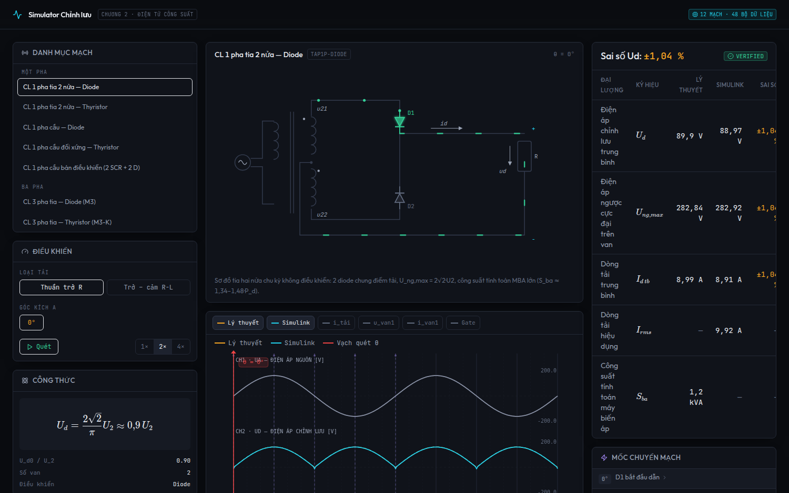
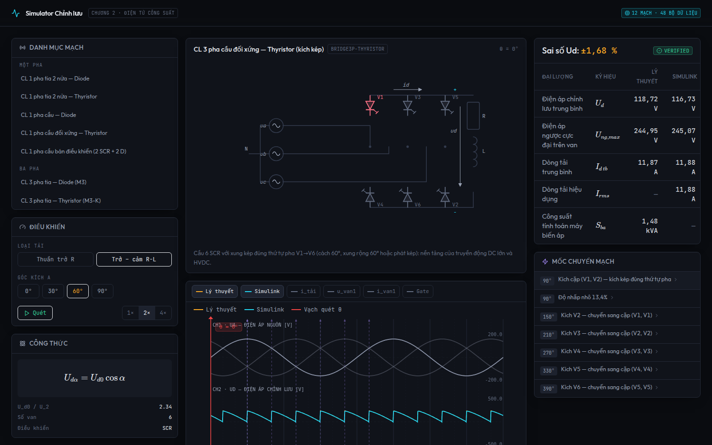
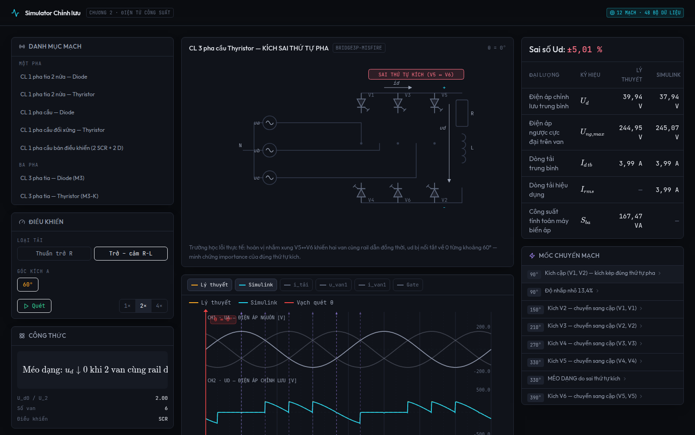
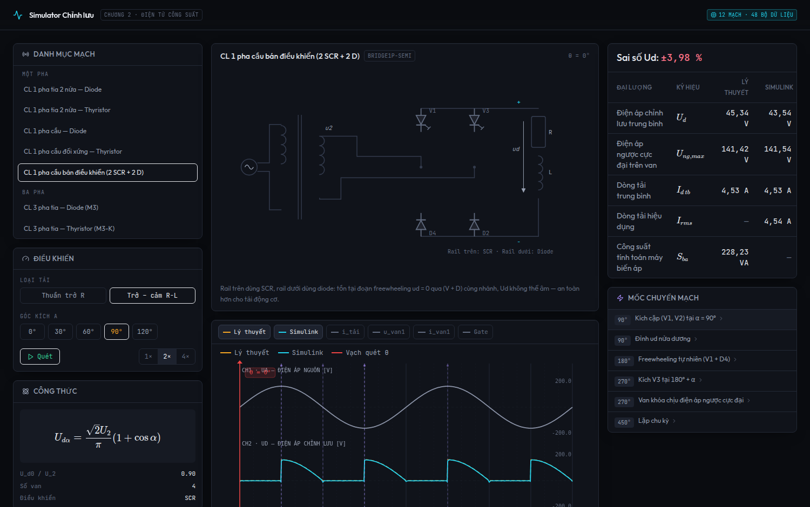

# Simulator Điện tử công suất — Simulink Verified Pipeline

Bộ mô phỏng & đối chiếu dữ liệu cho **Điện tử công suất (Chương 2, 3, 4, 5 — ĐH Công nghiệp Hà Nội)** gồm:

1. **Bộ dữ liệu 18 mạch / 83 bản ghi**:
   - **Chương 2 (Chỉnh lưu)**: 1P nửa chu kỳ Diode, 1P tia 2 nửa (Diode, Thyristor), 1P cầu (Diode, Thyristor, Bán ĐK), 3P tia (Diode, Thyristor), 3P cầu (Diode, Thyristor, Bán ĐK, Kích sai thứ tự).
   - **Chương 3 (Điều áp xoay chiều)**: Điều áp AC 1 pha (2 SCR ngược song song, R & RL), Điều áp AC 3 pha (6 SCR, tải sao).
   - **Chương 4 (Biến đổi DC-DC)**: Buck converter (giảm áp), Boost converter (tăng áp).
   - **Chương 5 (Nghịch lưu nguồn áp)**: Nghịch lưu 1 pha đối xứng (4 IGBT + 4 diode), Nghịch lưu 3 pha 180° (6 IGBT).
2. **Web simulator (Next.js 14)** — nạp dataset đã kiểm chứng:
   - Sơ đồ mạch SVG động cho **17 topology** (van đổi màu theo trạng thái dẫn, hạt dòng chạy, nhãn Tr/D/V/T).
   - Máy hiện sóng Canvas đa kênh: CH1 nguồn (kèm bao φ_E/φ_F cho 3P), CH2 u_d (Lý thuyết ↔ Simulink), CH3 i_tải, CH4 u_van, CH5 i_van, CH5b (khối dòng từng van — tải R: nửa sin, tải RL: phẳng, freewheeling nét gạch), CH6 Gate (xung đơn / xung kép 60°), CH7 dòng pha MBA.
   - Thang đo nhóm vật lý (V / A), chế độ **Quét liên tục** & **Bước ▸** qua từng mốc chuyển mạch.
   - Bảng đối chiếu Lý thuyết ↔ Simulink: tự động tính theo $U_d$ (chỉnh lưu/DC-DC) hoặc $U_{rms}$ (AC/Nghịch lưu) kèm huy hiệu **VERIFIED**.






## Chạy web simulator

```bash
npm install
npm run generate:data   # (tùy chọn) sinh lại dataset mock giải tích
npm run dev             # http://localhost:3000
```

Deep-link: `?catalog=pha3_bridge_thyristor&load=RL&alpha=60`

## Chạy pipeline Simulink thật

```bash
cd matlab
matlab -batch "run('export_simulink_data.m')"
# Yêu cầu: Simulink + Simscape Electrical (Specialized Power Systems)
# Kết quả: src/data/simulink_verified_dataset.simulink.json
```

Copy kết quả vào `public/data/simulink_verified_dataset.simulink.json` — web **tự ưu tiên** nạp dữ liệu Simulink, fallback về mock giải tích nếu chưa có.

## Cấu trúc

```
matlab/export_simulink_data.m        # Pipeline Simulink → JSON (11 mạch × α × tải)
scripts/generate-dataset.mjs         # Mock giải tích (chạy không cần MATLAB)
src/data/simulink_verified_dataset.json
src/types/simulator.ts               # Schema dùng chung TS ↔ JSON
src/store/useSimulatorStore.ts       # Zustand: chọn mạch/α/tải, quét θ, milestone
src/components/schematic/            # SVG 11 topology, trạng thái van động
src/components/oscilloscope/         # Canvas 6 kênh, scrubber θ
src/components/pedagogical/          # Card giải thích mốc chuyển mạch
src/components/comparison/           # Bảng Lý thuyết ↔ Simulink + % sai số
src/app/page.tsx                     # Dashboard dark-mode kỹ thuật
```

## Quy ước dữ liệu

- `udTheory`: giải tích chuẩn giáo trình; `udSimulink`: đo mô phỏng (chứa sụt áp thân van ~0,8 V/van, vệt lõm chuyển mạch, nhiễu) — sai số % được tính và hiển thị minh bạch.
- Lưới θ: 0→720°, bước 1° (2 chu kỳ lưới 50 Hz).
- Tham số: U₂ = U_ph = 100 V, f = 50 Hz, R = 10 Ω, L = 80 mH.
